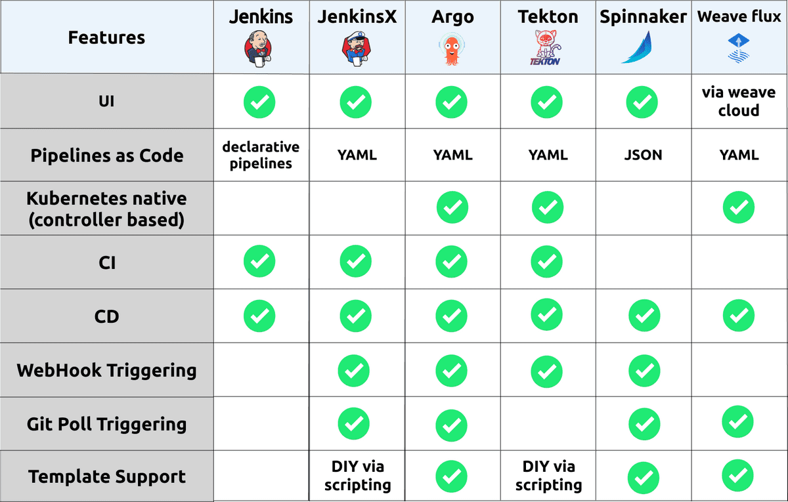
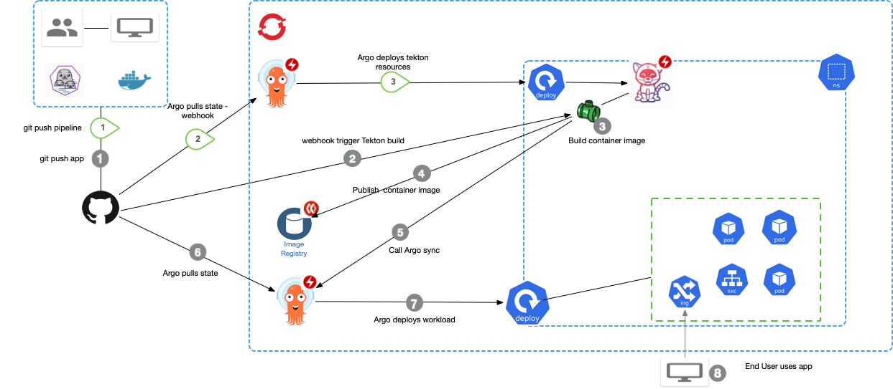

# Onderzoeksplan

### Inleiding

We onderzoeken in dit plan hoe we Tekton kunnen inzetten om pipelines te integreren met bestaande DevOps-processen. We richten ons op software DevOps-studenten die geïnteresseerd zijn in moderne CI/CD-oplossingen binnen Kubernetes-omgevingen.

### Hoofdvraag

**Hoe kan Tekton worden ingezet om pipelines te integreren met bestaande DevOps-processen?**

### Deelvragen

1. **Wat zijn de verschillen tussen Tekton en andere tools zoals Jenkins, GitHub Actions en Argo CD?**

   *Onderzoeksmethode: Vergelijkend literatuuronderzoek*

2. **Op welke manieren kan Tekton worden geïntegreerd met bestaande DevOps-processen en -tools?**

   *Onderzoeksmethode: Documentanalyse*

3. **Welke uitdagingen en beperkingen kunnen optreden bij de implementatie van Tekton, en hoe kunnen we deze overwinnen?**

   *Onderzoeksmethode: Literatuuronderzoek*

4. **Hoe kunnen we Tekton gebruiken om CI/CD-pipelines op te zetten binnen een Kubernetes-omgeving?**

   *Onderzoeksmethode: Praktijkonderzoek (experiment)*

5. **Wat is de impact van het gebruik van Tekton op de samenwerking binnen DevOps-teams?**

   *Onderzoeksmethode: Literatuuronderzoek*

### Kerntekst

#### Antwoorden op de deelvragen

**1. Wat zijn de verschillen tussen Tekton en andere tools zoals Jenkins, GitHub Actions en Argo CD?**

Tekton is een Kubernetes-native open-source framework voor het bouwen van CI/CD-systemen (Tekton, 2024). Het onderscheidt zich door het gebruik van Kubernetes Custom Resource Definitions (CRD's) om pipeline-onderdelen te definiëren, wat zorgt voor naadloze integratie met Kubernetes-clusters.

(*Figuur 1*: Overzicht van de verschillen tussen Tekton, Jenkins, GitHub Actions en Argo CD.)

Jenkins is een gevestigde CI/CD-automatiseringsserver die al lange tijd wordt gebruikt in diverse omgevingen. Hoewel we Jenkins kunnen integreren met Kubernetes via plug-ins, is het oorspronkelijk niet ontworpen voor cloud-native omgevingen, wat kan leiden tot complexiteit bij schaalvergroting en beheer (Red Hat, 2024).

GitHub Actions biedt een geïntegreerde CI/CD-oplossing binnen het GitHub-ecosysteem. We kunnen workflows automatiseren op basis van GitHub-events. Hoewel het gebruiksvriendelijk is voor projecten op GitHub, mist het de diepgaande Kubernetes-integratie die Tekton biedt (GitHub Docs, 2024).

Argo CD is een continuous delivery-tool die GitOps-principes implementeert voor Kubernetes. In tegenstelling tot Tekton, dat zowel CI als CD faciliteert, richt Argo CD zich specifiek op CD-processen en het synchroniseren van de gewenste toestand met de actuele toestand van Kubernetes-clusters (Argo CD, 2024).

**2. Op welke manieren kan Tekton worden geïntegreerd met bestaande DevOps-processen en -tools?**

We kunnen Tekton integreren met bestaande DevOps-processen door koppeling aan versiebeheersystemen zoals Git voor broncodebeheer. Door pipelines te configureren met triggers, reageren ze op events zoals code-commits en starten ze automatische build- en deploy-processen (Tekton, 2024).

Voor Continuous Integration verbinden we Tekton met tools zoals GitHub, GitLab of Bitbucket om codewijzigingen te detecteren. Voor artifactbeheer laten we Tekton samenwerken met containerregistries om containerimages te bouwen en op te slaan. Bovendien ondersteunt Tekton integratie met tools voor supply chain security om de veiligheid van CI/CD-pipelines te waarborgen (Tekton Chains, 2024).

**3. Welke uitdagingen en beperkingen kunnen optreden bij de implementatie van Tekton, en hoe kunnen we deze overwinnen?**

Tijdens de implementatie van Tekton kunnen we uitdagingen tegenkomen:

- **Leercurve**: Het werken met Tekton vereist kennis van Kubernetes en containertechnologieën, wat een uitdaging kan zijn voor teams zonder deze expertise (Agnihotri, 2024). We overwinnen dit door training en het gebruik van uitgebreide documentatie.
- **Complexiteit van Kubernetes**: De afhankelijkheid van Kubernetes kan complexiteit toevoegen, zoals beheer van clusterbeveiliging. Door managed Kubernetes-services te gebruiken, verminderen we deze complexiteit.
- **Debugging en Monitoring**: Het troubleshooten van pipelines is uitdagend door de gedistribueerde aard van Kubernetes. Integratie met monitoring- en logging-tools helpt deze uitdaging te overwinnen.

**4. Hoe kunnen we Tekton gebruiken om CI/CD-pipelines op te zetten binnen een Kubernetes-omgeving?**

We zetten Tekton in door de volgende stappen:

1. **Installatie van Tekton**: Implementatie van Tekton Pipelines in het Kubernetes-cluster (Tekton, 2024).
2. **Definiëren van Tasks**: Definiëren van individuele stappen als Tasks, uitgevoerd in containers.
3. **Creëren van Pipelines**: Bouwen van Pipelines door Tasks te sequencen.
4. **Instellen van Triggers**: Configureren van Tekton Triggers om pipelines automatisch te starten.
5. **Uitvoeren van PipelineRuns**: Starten van de pipeline door PipelineRuns te creëren.
6. **Monitoring en Logging**: Gebruik van Kubernetes logs en monitoringtools voor optimalisatie.

(*Figuur 2*: Schematische weergave waarop Tekton wordt geïmplementeerd.)

Praktische gidsen zoals de "Tekton on IBM Cloud" serie van Ebert (2020a, 2020b, 2020c) en de blogpost van IBM Cloud (2024) bieden stapsgewijze instructies voor het opzetten van pipelines.

**5. Wat is de impact van het gebruik van Tekton op de samenwerking binnen DevOps-teams?**

Het gebruik van Tekton verbetert de samenwerking binnen DevOps-teams:

- **Uniformiteit en standaardisatie**: Door pipelines als code te definiëren, creëren we een uniforme werkwijze.
- **Transparantie en versiebeheer**: Opslag van pipelines in versiebeheersystemen bevordert transparantie.
- **Autonomie en efficiëntie**: Ontwikkelaars kunnen zelfstandig pipelines aanpassen, wat de ontwikkelingscyclus versnelt (Agnihotri, 2024).

### Conclusie

Tekton biedt een krachtige oplossing voor het integreren van pipelines met bestaande DevOps-processen binnen Kubernetes. Door uitdagingen aan te pakken en Tekton's mogelijkheden te benutten, verbeteren we samenwerking en realiseren we efficiëntere CI/CD-processen.

---

## Bronnen

1. Tekton. (2024). *Welcome to Tekton*. Geraadpleegd op 10-10-2024 via [https://tekton.dev/](https://tekton.dev/)
2. Red Hat. (2024). *Tekton vs. Jenkins: What's better for CI/CD pipelines on Red Hat OpenShift?* Geraadpleegd op 10-10-2024 via [https://www.redhat.com/en/blog/tekton-vs-jenkins-whats-better-cicd-pipelines-red-hat-openshift](https://www.redhat.com/en/blog/tekton-vs-jenkins-whats-better-cicd-pipelines-red-hat-openshift)
3. Argo CD. (2024). *What Is Argo CD?* Geraadpleegd op 10-10-2024 via [https://argo-cd.readthedocs.io/en/stable/](https://argo-cd.readthedocs.io/en/stable/)
4. GitHub Docs. (2024). *Understanding GitHub Actions*. Geraadpleegd op 10-10-2024 via [https://docs.github.com/en/actions/learn-github-actions/understanding-github-actions](https://docs.github.com/en/actions/learn-github-actions/understanding-github-actions)
5. Tekton Chains. (2024). *Supply Chain Security*. Geraadpleegd op 10-10-2024 via [https://tekton.dev/docs/chains/](https://tekton.dev/docs/chains/)
6. Agnihotri, S. (2024). *Tekton - A Kubernetes-native CI/CD: Day 46 of 50 days DevOps Tools Series*. Geraadpleegd op 10-10-2024 via [https://dev.to/shivam_agnihotri/tekton-a-kubernetes-native-cicd-day-46-of-50-days-devops-tools-series-3e9g](https://dev.to/shivam_agnihotri/tekton-a-kubernetes-native-cicd-day-46-of-50-days-devops-tools-series-3e9g)
7. IBM Cloud. (2024). *Learn how to use Tekton pipelines in your CI/CD pipelines in the IBM Cloud*. Geraadpleegd op 10-10-2024 via [https://www.ibm.com/blog/tekton-in-the-ibm-cloud-part-1/](https://www.ibm.com/blog/tekton-in-the-ibm-cloud-part-1/)
8. Ebert, D. (2020a). *Tekton on IBM Cloud Level 1: Hello World (Part 1)*. Geraadpleegd op 10-10-2024 via [https://medium.com/@dannyeb/tekton-on-ibm-cloud-level-1-hello-world-part-1-6a7800e9f2d4](https://medium.com/@dannyeb/tekton-on-ibm-cloud-level-1-hello-world-part-1-6a7800e9f2d4)
9. Ebert, D. (2020b). *Tekton on IBM Cloud Level 1: Hello World (Part 2)*. Geraadpleegd op 10-10-2024 via [https://medium.com/@dannyeb/tekton-on-ibm-cloud-level-1-hello-world-part-2-c623a5179509](https://medium.com/@dannyeb/tekton-on-ibm-cloud-level-1-hello-world-part-2-c623a5179509)
10. Ebert, D. (2020c). *Tekton on IBM Cloud Level 2: Parameters*. Geraadpleegd op 10-10-2024 via [https://medium.com/@dannyeb/tekton-on-ibm-cloud-level-2-parameters-2ebb32c2d329](https://medium.com/@dannyeb/tekton-on-ibm-cloud-level-2-parameters-2ebb32c2d329)
11. Benebsworth, B. (z.d.). *Kubernetes CI/CD Part 2: Tekton Pipelines*. Geraadpleegd op 10-10-2024 via [https://benebsworth.com/kubernetes-cicd-part-2/](https://benebsworth.com/kubernetes-cicd-part-2/)
12. Barcia, R. (2019). *Fun with GitOps: Stitching Kubernetes, Tekton, and Argo*. Geraadpleegd op 10-10-2024 via [https://rbarcia.medium.com/fun-with-gitops-stitching-kubernetes-tekton-and-argo-ee348afd0b08](https://rbarcia.medium.com/fun-with-gitops-stitching-kubernetes-tekton-and-argo-ee348afd0b08)

---

### Afbeeldingen

   *Figuur 0*: Logo van Tekton, de CNCF-tool die centraal staat in dit onderzoek.

   Bron: [https://tekton.dev/](https://tekton.dev/)

   *Figuur 1*: Overzicht van de verschillen tussen Tekton, Jenkins, GitHub Actions en Argo CD.

   Bron: [https://benebsworth.com/kubernetes-cicd-part-2/](https://benebsworth.com/kubernetes-cicd-part-2/)

   *Figuur 2*: Schematische weergave waarop Tekton wordt geïmplementeerd.

   Bron: [https://rbarcia.medium.com/fun-with-gitops-stitching-kubernetes-tekton-and-argo-ee348afd0b08](https://rbarcia.medium.com/fun-with-gitops-stitching-kubernetes-tekton-and-argo-ee348afd0b08)

---