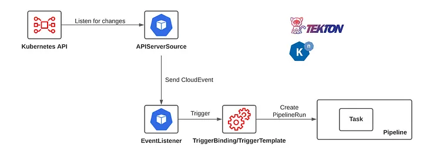
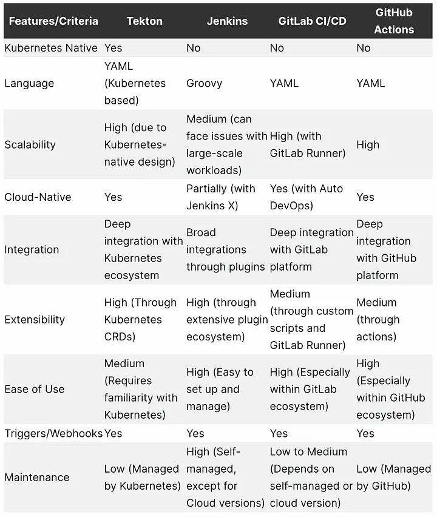

# Tekton: 'Objectgeoriënteerde' Jenkins met een Kubernetes-sausje


*[Luuk Stins, oktober 2024.](https://github.com/hanaim-devops/devops-blog-luukjp)*

<hr/>

In de DevOps wereld zijn er heel veel CI/CD-oplossingen (Continuous Integration/Continuous Delivery). Een aantal waar je waarschijnlijk al een keer eerder van heb gehoord of mee hebt gewerkt zijn: Jenkins, Github Actions en Gitlab CI/CD. In dit blog vertel ik wat Tekton is, vergelijk ik het met andere CI/CD-tools en toon ik hoe je het kunt inzetten binnen grote (maar ook kleine) teams.

## Wat is Tekton?

Tekton begon ooit binnen Google als onderdeel van het Knative-project, een open-source initiatief voor serverless computing. Voor sommigen is de afhankelijkheid van Google reden tot zorg, gezien Google's reputatie om open-source projecten abrupt te stoppen. Gelukkig heeft Google – de vriendelijke multinational die het is – ons allemaal verrast met hun ongekende vrijgevigheid door Tekton in 2019 te doneren aan de Continuous Delivery Foundation. Dit gaf Tekton een toekomst binnen een gemeenschap, waar het open-source principe voorop blijft staan. (Google Open Source Blog, 2020)

Maar wat maakt Tekton nu eigenlijk zo bijzonder? Tekton is een open-source Kubernetes-native CI/CD-framework, dit houd in dat het is ontworpen om rechtstreeks te werken met Kubernetes API's en objecten. Dit betekent dat Tekton de CI/CD configuraties (zoals pipelines en tasks) beheert als Kubernetes resources, net als andere Kubernetes onderdelen
Het onderscheidende kenmerk van Tekton vergeleken met andere CI/CD tools is de modulaire en schaalbare architectuur. CI/CD-pipelines in Tekton worden opgebouwd uit afzonderlijke tasks en steps, waarbij elke step in een eigen container wordt uitgevoerd. Dit zorgt voor flexibiliteit en herbruikbaarheid, aangezien pipelines gemakkelijk kunnen worden aangepast en uitgebreid. (Agnihotri, S. 2024)

<figure align="left">
    
    <figcaption><em>Figuur 1</em>: Tekton</figcaption>
</figure>

## Vergelijking met Andere CI/CD Tools

Zoals eerder vermeld zijn er verschillende CI/CD-oplossingen beschikbaar, maar Tekton onderscheidt zich van tools zoals Jenkins, GitHub Actions en Gitlab CI/CD door zijn diepe integratie met Kubernetes en modulariteit. Laten we een aantal verschillen bekijken:

- **Jenkins**: Hoewel Jenkins voor velen al een vertrouwde naam is, is het oorspronkelijk niet ontworpen voor cloud-native (is een manier van software bouwen en draaien die speciaal is ontworpen om optimaal gebruik te maken van de cloud) omgevingen. Dit betekent dat het zonder plugins (lang leve het beheren van duizend plugins) beperkingen kent. Hierdoor kunnen er uitdagingen ontstaan bij het schalen van Jenkins binnen Kubernetes en bij de configuratie.
- **GitHub Actions**: GitHub Actions biedt een geïntegreerde CI/CD-oplossing binnen het GitHub-ecosysteem, ideaal voor projecten die volledig binnen GitHub werken, zoals kleine tot middelgrote projecten. De YAML-configuratie maakt het opzetten van workflows eenvoudig, en de vele kant-en-klare acties versnellen de ontwikkeling. GitHub Actions maakt het gemakkelijk om snelle en simpele workflows te creëren zonder veel opzet. Echter, het schalen van workflows is afhankelijk van de GitHub-infrastructuur, waardoor het minder geschikt is voor zeer intensieve taken (zoals het compileren van Chromium). (GitHub Docs, 2024)
- **GitLab CI/CD**: Integreert naadloos met GitLab en biedt uitgebreide ondersteuning voor DevOps-taken. Hoewel het goed werkt met Docker en Kubernetes, vereist het meer handmatige configuraties voor Kubernetes-specifieke integraties vergeleken met Tekton, dat juist volledig op Kubernetes is gericht.

In tegenstelling tot Tekton hebben Jenkins, GitHub Actions en GitLab CI/CD weliswaar mogelijkheden voor het hergebruiken van stappen of scripts, maar ze bieden minder gestructureerde manieren om herbruikbare en modulaire workflows te creëren. Bij deze tools zijn teams vaak afhankelijk van handmatig beheer van scripts, configuratiebestanden of het kopiëren van gedeelde templates, wat leidt tot code duplicatie en moeilijker te onderhouden pipelines. (8 Grams, 2020)

<figure align="left">
    
    <figcaption><em>Figuur 2</em>: Vergelijking met Andere CI/CD Tools</figcaption>
</figure>

## De Impact van Tekton op Samenwerking binnen 'Enterprise' Teams

Hoewel Tekton prima werkt voor kleinere development teams, laat het pas echt z'n waarde zien in grote enterprise-omgevingen, waar teams vaak niet precies weten wat anderen doen of wat de vorige persoon heeft achtergelaten. Hierbij kan Tekton helpen om de samenwerking en productiviteit op gang te houden door (Chaudhary, D. 2020)

- **Modulariteit en Herbruikbaarheid**: Door pipelines als code te schrijven, kunnen teams nieuwe pipelines opzetten en bestaande aanpassen volgens vaste afspraken. In Tekton worden deze pipelines gedefinieerd met YAML-bestanden, zodat er geen ruimte meer is voor de stagiair om zijn eigen scripts in elkaar te flansen.
- **Gebruik van Git voor Versiebeheer**: De YAML-bestanden van pipelines worden opgeslagen in Git, wat betekent dat je eenvoudig kunt reverten naar een eerdere versie, wijzigingen kunt bijhouden en snel kunt ingrijpen als er toch een PR zonder review doorheen glipt.
- **Samenwerking en Transparantie**: Doordat alle pipeline-configuraties in Git staan, heb je volledig inzicht in de CI/CD-processen. Zo kun je effectief samenwerken aan verbeteringen, code reviews uitvoeren, en fouten herstellen als er iets misgaat, zodat niemand kan zeggen dat ze "dat stukje code niet hebben gezien."

## Uitdagingen bij het gebruik van Tekton

Het zou bijna lijken alsof Tekton de perfecte oplossing is voor al je problemen – net zoals het nieuwste JavaScript framework dat je vandaag tegenkomt, dat beweert de "volgende grote doorbraak" te zijn. Maar is dat wel zo? Ook Tekton heeft zo zijn uitdagingen waar rekening mee gehouden moet worden. Zo heeft Tekton een:

- **Leercurve**: Tekton vereist kennis van Kubernetes en containertechnologieën. Teams zonder deze ervaring kunnen een steile leercurve ervaren, wat nadelig kan zijn als er al een CI/CD-omgeving met een andere tool is gebouwd waar het team wel ervaring mee heeft.

- **Complexiteit van Kubernetes**: Het beheren van CI/CD-workflows binnen Kubernetes brengt extra complexiteit met zich mee. Hoewel managed Kubernetes-services deze complexiteit kunnen verlichten, moet je daar vaak wel dieper voor in de portemonnee tasten. Voor een startup is dat niet altijd de beste keuze, vooral als budgetten al krap zijn en je liever investeert in productontwikkeling dan in dure infrastructuur.

- **Troubleshooting en monitoring**: Problemen oplossen in een gedistribueerde Kubernetes-omgeving kan behoorlijk ingewikkeld zijn. Het is daarom sterk aanbevolen om integraties met logging en monitoringtools  te gebruiken om meer inzicht te krijgen in de werking van je pipelines. Maar ook dat komt niet zonder kosten, dus als je dacht dat je hiermee klaar was, komt er nog een extra rekening om de hoek kijken.

## Tekton CI/CD Pipeline Demo binnen Kubernetes

In een korte demo laat ik je zien hoe je een super eenvoudige CI/CD-pipeline kunt opzetten met Tekton in een Kubernetes-omgeving. (Ebert, D. 2020)

### 1. Maak een Taak

Maak een bestand genaamd `hello-world-task.yaml`:

```yaml
apiVersion: tekton.dev/v1beta1
kind: Task
metadata:
  name: hello-world
spec:
  steps:
    - name: echo
      image: alpine
      script: |
        #!/bin/sh
        echo "Hallo, Wereld!"
```

Voer de taak uit in je Kubernetes-cluster:

```bash
kubectl apply -f hello-world-task.yaml
```

### 2. Maak een Pipeline

Maak een bestand genaamd `hello-world-pipeline.yaml`:

```yaml
apiVersion: tekton.dev/v1beta1
kind: Pipeline
metadata:
  name: hello-world-pipeline
spec:
  tasks:
    - name: zeg-hallo
      taskRef:
        name: hello-world
```

Voer de pipeline uit in het cluster:

```bash
kubectl apply -f hello-world-pipeline.yaml
```

### 3. Maak een PipelineRun

Maak een bestand genaamd `hello-world-pipelinerun.yaml`:

```yaml
apiVersion: tekton.dev/v1beta1
kind: PipelineRun
metadata:
  name: hello-world-pipelinerun
spec:
  pipelineRef:
    name: hello-world-pipeline
```

Voer de `PipelineRun` uit:

```bash
kubectl apply -f hello-world-pipelinerun.yaml
```

### 4. Controleer de Status van de PipelineRun

Je kunt de status van de PipelineRun controleren met:

```bash
tkn pipelinerun logs hello-world-pipelinerun -f
```

## Conclusie

Tekton biedt een cloud-native aanpak voor CI/CD, die zich onderscheidt door zijn integratie met Kubernetes en modulaire architectuur. Het stelt teams in staat om schaalbare en herbruikbare workflows te creëren, wat met traditionele tools als Jenkins of GitHub Actions minder makkelijke en gestructureerd behaalbaar kan zijn. Vooral in grotere enterprise-omgevingen komt Tekton tot zijn recht, waar samenwerking, versiebeheer en schaalbaarheid van belang zijn.

Toch is Tekton niet de perfecte oplossing voor alles. De leercurve en de complexiteit van Kubernetes kunnen een obstakel vormen, vooral voor teams die nog niet eerder met Kubernetes en Tekton zelf hebben gewerkt. Bovendien brengt het beheren van gedistribueerde omgevingen extra kosten en complexiteit met zich mee. Desondanks biedt Tekton met zijn uitgebreide configuratiemogelijkheden en Kubernetes-integratie een goede keuze voor teams die een toekomstbestendige cloud-native CI/CD-oplossing zoeken.

## Bronnen

- GitHub Docs. (2024). *Understanding GitHub Actions*. Geraadpleegd op 10 oktober 2024, van [https://docs.github.com/en/actions/learn-github-actions/understanding-github-actions](https://docs.github.com/en/actions/learn-github-actions/understanding-github-actions).
- Agnihotri, S. (2024). *Tekton - A Kubernetes-native CI/CD: Day 46 of 50 days DevOps Tools Series*. Geraadpleegd op 10 oktober 2024, van [https://dev.to/shivam_agnihotri/tekton-a-kubernetes-native-cicd-day-46-of-50-days-devops-tools-series-3e9g](https://dev.to/shivam_agnihotri/tekton-a-kubernetes-native-cicd-day-46-of-50-days-devops-tools-series-3e9g).
- Ebert, D. (2020). *Tekton on IBM Cloud Level 1: Hello World (Part 1)*. Geraadpleegd op 10 oktober 2024, van [https://medium.com/@dannyeb/tekton-on-ibm-cloud-level-1-hello-world-part-1-6a7800e9f2d4](https://medium.com/@dannyeb/tekton-on-ibm-cloud-level-1-hello-world-part-1-6a7800e9f2d4).
- Chaudhary, D. (2020). *Building CI/CD systems using Tekton*. Geraadpleegd op 10 oktober 2024, van [https://medium.com/@dipendra.chaudhary/building-ci-cd-systems-using-tekton-3075a8a60292](https://medium.com/@dipendra.chaudhary/building-ci-cd-systems-using-tekton-3075a8a60292).
- 8 Grams. (2020). *Tekton: The open-source Kubernetes-native CI/CD tools*. Geraadpleegd op 10 oktober 2024, van [https://8grams.medium.com/tekton-the-open-source-kubernetes-native-ci-cd-tools-55c49db53234](https://8grams.medium.com/tekton-the-open-source-kubernetes-native-ci-cd-tools-55c49db53234).
- Google Open Source Blog. (2020). *The Tekton Pipelines Beta release*. Geraadpleegd op 10 oktober 2024, van [https://opensource.googleblog.com/2020/05/the-tekton-pipelines-beta-release.html](https://opensource.googleblog.com/2020/05/the-tekton-pipelines-beta-release.html).
